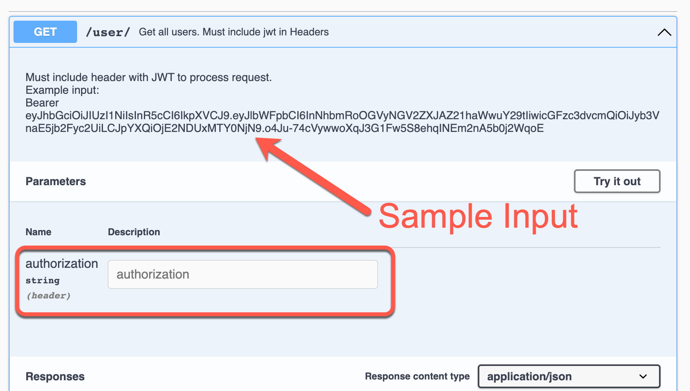

# Lesson 8 Class Start

The code for this class activity will pick up where the lesson 7 class activity concluded.

## Steps to complete activity

#### Getting started with the code

- Download this code
- Run npm install
- Run npm start

#### Creating the request

- Create a simple GET request which will retrieve data from a MongoDB collection of your choice (Be sure to create an .env file for your MONGODB URI).

#### Swagger documentation and testing

- Create a Swagger.json file for this route. You may use [swagger-autogen](https://www.npmjs.com/package/swagger-autogen) if you wish.
- Create an "/api-docs" route like we've done before so that you can access the swagger ui. You may use [swagger-ui-express](https://www.npmjs.com/package/swagger-ui-express) if you wish.
- Test the GET request with your swagger ui to ensure it works.

#### Incorporating OAuth

- Add the requiresAuth() middleware provided by Auth0 to the route you created previously.
- If you try testing your route with your Swagger UI now, it will not work.
- You need to make the request using the JWT. [This article](https://poopcode.com/add-jwt-authentication-to-your-swagger-api-docs/) shows how you can do this with Swagger. You should end up with something like this:
  
- [This information](https://auth0.com/blog/node-js-and-express-tutorial-building-and-securing-restful-apis/) may be helpful in figuring out how to return the token to the frontend after a login takes place.
- Now your requests can successfully be executed via the Swagger UI (given that you have a valid JWT).

## Solution

[GitHub Repo](https://github.com/byui-cse/cse341-code-student/tree/L08-class-complete)
